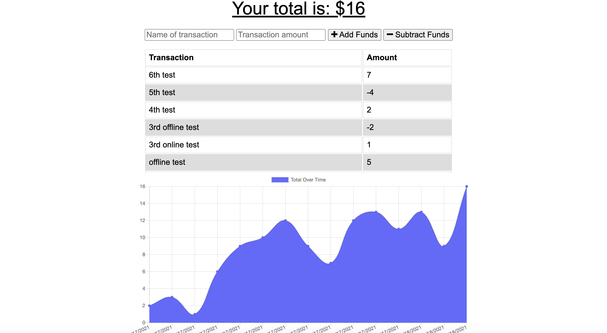

# On-Budget PWA-Budget Tracker
## by Aaron Rosenblatt

### I cloned a starter code to update an existing budget tracker application to allow for offline access and functionality. When there is no internet connection, the user can input an expense or deposit and they will receive a notification that they have added an expense or deposit. When the user reestablishes an internet connection, the expenses and deposits the user made while offline will be added to their transaction history and their totals will be updated. 

### Using the starter code, I added an IndexedDB to add offline functionality. I also added a service worker to make the app a Progressive Web Application. Next, I created a web manifest to let users’ devices know what they’re installing and how the app should look on the home screen. Finally, I deployed the app to Heroku using MongoDB Atlas. 

### The On-Budget PWA-Budget Tracker app can be viewed here: https://rosenblatt-budgettrackerpwa.herokuapp.com/

### The GitHub repository for On-Budget PWA-Budget Tracker can be viewed here: https://github.com/noplur/on-budget-pwa-budget-tracker

### Here is a screenshot of a sample from the On-Budget PWA-Budget Tracker:
### 